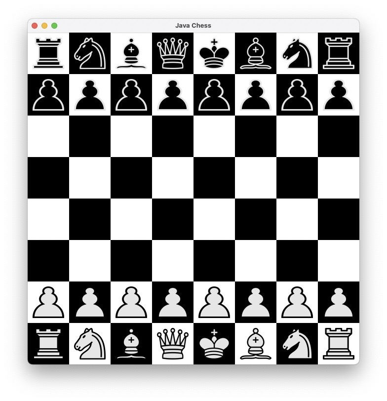
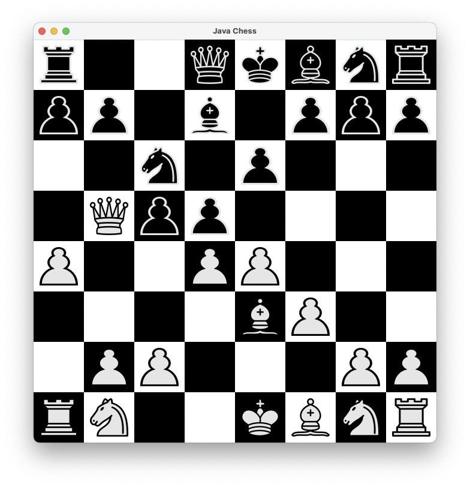
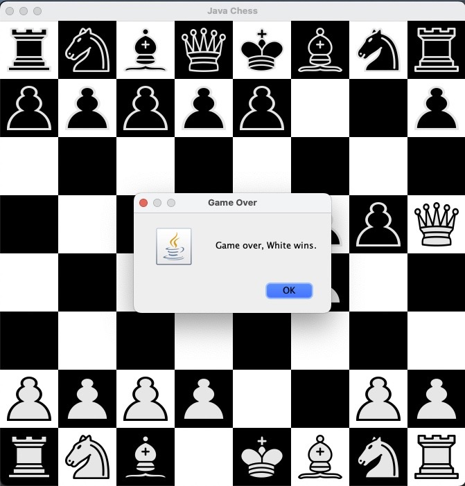

# chess
Chess engine implemented using Java.

GUI written with Java Swing.

Uses many Object-Oriented Programming principles including abstraction, encapsulation, abstract classes, inheritance, polymorphism, interfaces, etc.

# Installation
Open the project in your preferred (Java-compatible) IDE and run the main method.

A new window will appear with the GUI.

# Overview

## Images

# Starting game

# Mid game

# Game Over

